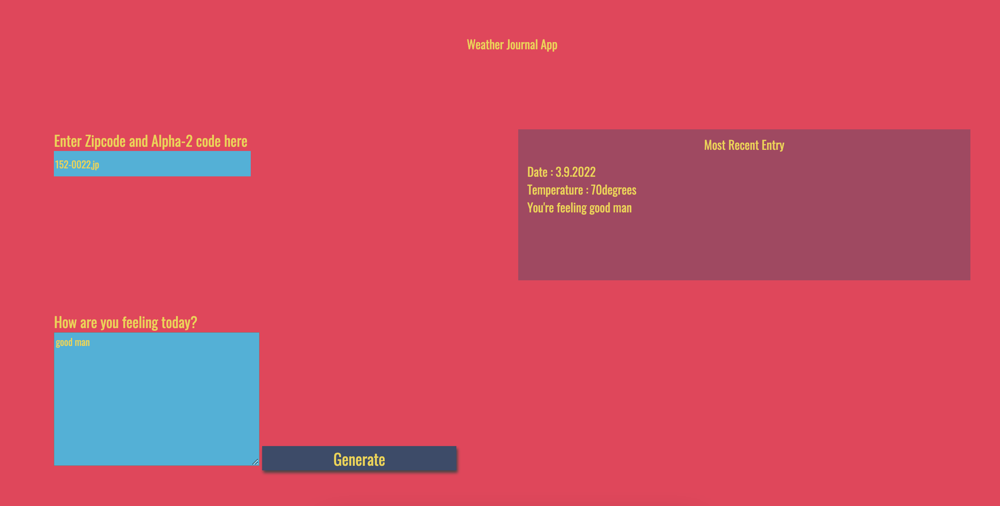

# Weather-Journal App Project

## Overview
This project demonstrates how to create asynchronous web application with node.js and some interactive functionalies using pure Jacascript where the user can get wheather information on given location（zipcode）. The below picture is the expected result after user's inputting.

## Expected Output

## Instructions
This will require modifying the `server.js` file and the `website/app.js` file. You can see `index.html` for element references, and once you are finished with the project steps, you can use `style.css` to style your application to customized perfection.

## HOW TO USE THIS APP
The user only need to:

- Enter a valid zip code, followed by a comma(with no space) then country code (all lowercased) in the input area. (e.g. 166-0012,jp, 94040,us)
- Write a feeling in the textarea. For example "Its chilly outside"
- Hit then "Generate" button to get the weather information and feeling.